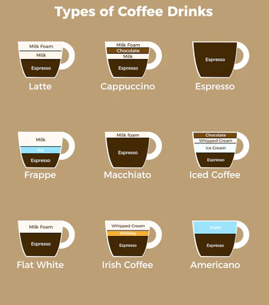

User Guide
==========

All about coffees
+++++++++++++++++

Implementation of design patterns will be based on the coffee related examples. Picture below shows different types of 
coffees that could be prepared in one or another pattern.

Command Line interface
++++++++++++++++++++++

.. click:: designpatterns.cli.creational_patterns:cli
    :prog: creationalpatterns
    :nested: full

.. click:: designpatterns.cli.structural_patterns:cli
    :prog: structuralpatterns
    :nested: full